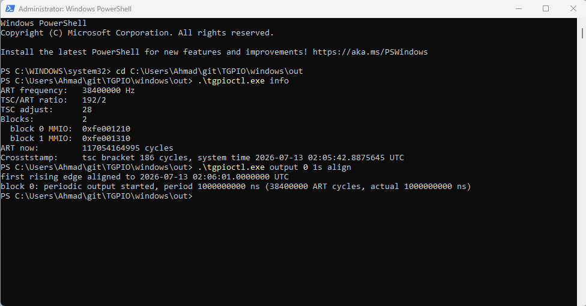

# TGPIO on Windows

Author: Ahmad Byagowi

Experimental Windows port of the TGPIO driver's hardware layer: a
root-enumerated KMDF driver (`tgpio.sys`) plus a user-mode control tool
(`tgpioctl.exe`). Like the Linux reference driver, it does **not** depend on
firmware ACPI enumeration -- the MMIO bases are registry parameters with the
same defaults (`0xFE001210` / `0xFE001310`, size `0x38`).

Windows has no PTP hardware clock abstraction, so the design differs from
Linux: the kernel driver is a thin deterministic hardware layer that deals
only in raw ART cycles (derived from the invariant TSC via CPUID leaf 0x15
and `IA32_TSC_ADJUST`), and exposes a TSC-bracketed precise crosststamp.
All wall-clock math lives in `tgpioctl`.

## Scope (v1 bring-up)

Ported: hardware periodic output (toggle engine, grid-aligned start,
late-arm guard, level-flop parity tracking, glitch-free polarity invert,
PM-paused compare rewrites), external timestamp input with per-edge
selection, capture/event-count readout, ART/TSC crosststamps.

Not yet ported: asymmetric duty (needs the per-edge PIV service loop),
one-shot pulses, phase nudging/servo, auto-polarity, PPS, discipline.

## Host-side tests

`tests/host/run.sh` compiles `hw.c`/`art.c` against stub kernel headers and
unit-tests the programming sequences (arm ordering, flop parity, late-arm
guard, PM-paused rewrites) on any machine with a C compiler -- no WDK
needed. Run it after touching `hw.c`.

## Build

On the Windows test machine, install Visual Studio (Community is fine) with
C++ workload plus the matching [WDK](https://learn.microsoft.com/windows-hardware/drivers/download-the-wdk),
or use a standalone EWDK ISO. Then:

```bat
cd windows
build.cmd
```

Outputs: `driver\x64\Release\tgpio\` (driver package) and `out\tgpioctl.exe`.

## Install (test machine only)

The build test-signs the driver. Enable test signing once and reboot:

```bat
bcdedit /set testsigning on
shutdown /r /t 0
```

Then install the driver package and create the root-enumerated device
(devcon ships with the WDK under `Tools\x64`):

```bat
pnputil /add-driver driver\x64\Release\tgpio\tgpio.inf /install
devcon install driver\x64\Release\tgpio\tgpio.inf ROOT\TGPIO
```

Windows will warn that the driver is test-signed; accept. If `devcon` is
not on PATH it lives in the WDK under `Tools\x64\devcon.exe`.

To change MMIO addresses, edit
`HKLM\SYSTEM\CurrentControlSet\Services\tgpio\Parameters`
(`Addr0Low/High`, `Addr1Low/High`, `MmioSize`, `UseSecond`,
`ArtFrequencyHz`) and restart the device (`devcon restart ROOT\TGPIO`).
Client SKUs often report the TSC/ART ratio but not the crystal frequency
in CPUID leaf 0x15; if `tgpioctl info` fails to start, set
`ArtFrequencyHz` (e.g. 38400000 for a 38.4 MHz crystal).

## Windows machine prep

- **Disable Hyper-V / virtualization-based security** (Memory Integrity /
  Core Isolation, WSL2, Hyper-V features). Under a hypervisor the TSC can
  be offset or virtualized, which silently breaks the TSC-to-ART
  correlation this driver depends on. Bare metal only.
- Enable test signing (below) and expect kernel debugging to be handy:
  `bcdedit /debug on` plus KDNET if a second box is available.
- The TGPIO MMIO blocks must not be power-gated by firmware; use the same
  BIOS settings as the Linux DUT if this is the same platform class.

## Usage

```bat
tgpioctl info                 :: ART frequency, ratio, crosststamp
tgpioctl output 0 1s align    :: 1 PPS on block 0, edges on UTC seconds
tgpioctl input 1 rising       :: capture rising edges on block 1
tgpioctl watch 1              :: poll and print captures with UTC times
tgpioctl status 0             :: raw block state
tgpioctl invert 0             :: fix polarity if the waveform is inverted
tgpioctl stop 0
```

Successful Windows bring-up with both TGPIO MMIO blocks detected and block 0
armed for a UTC-aligned 1 Hz periodic output:



## Bring-up test plan

1. `tgpioctl info` -- sanity: ART frequency matches the Linux DUT
   (CPUID 15h crystal), TSC bracket small.
2. Loopback block 0 -> block 1 (or onto the Saleae): `tgpioctl output 0 1s`,
   confirm a 1 Hz square wave on the pin.
3. `tgpioctl input 1 rising` + `tgpioctl watch 1` -- event count advances
   1/s, capture-to-capture deltas within a few ART cycles of nominal.
4. `tgpioctl output 0 1s align` -- compare edge times on the analyzer
   against a reference PPS; expect crystal-ppm drift (no discipline yet).
5. Polarity: same caveat as Linux -- the level flop is write-only and
   nondeterministic after power cycles; use `invert` if the waveform is
   upside down.

## Safety notes

- The device maps raw physical MMIO; the INF restricts open to
  Administrators/SYSTEM. Wrong `Addr*` values can touch unrelated hardware
  -- keep the Linux-verified addresses.
- Register writes while a block runs follow the same rules as Linux: full
  disable/arm cycles only, PIV/COMPV hot rules enforced in `hw.c`.
